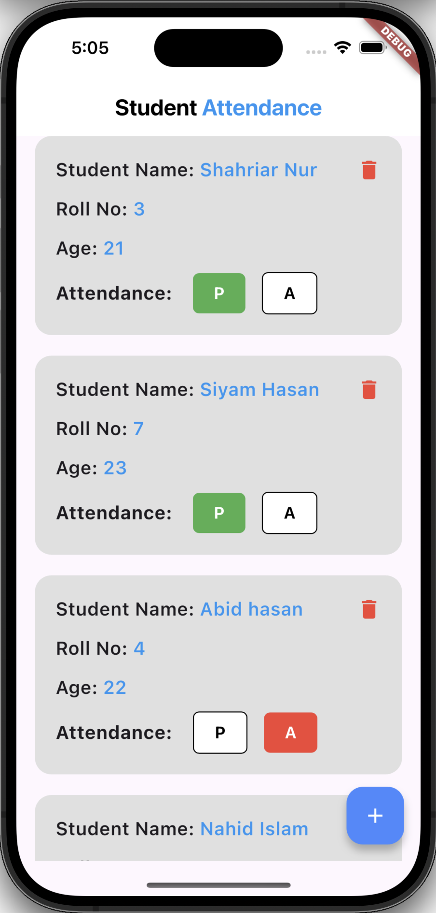
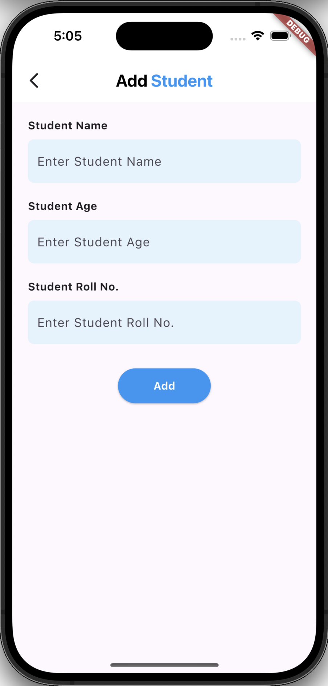

<div align="center">

<h1>🎓 Student Attendance (Flutter + Firebase)</h1>

<p>A lightweight, real‑time student attendance management app built with <strong>Flutter</strong> and powered by <strong>Firebase Cloud Firestore</strong>. Mark presence (✅ Present / ❌ Absent), add students on the fly, and manage data instantly with a clean UI.</p>

<p>
  
  
  
  
  
</p>

</div>

---

## ✨ Key Features

-   🔄 Real‑time sync with Firestore (live updates to attendance & student list)
-   ➕ Add new students with name, age & roll number
-   🟢 Mark Present (P) / 🔴 Mark Absent (A) per student
-   🗑️ Safe delete with confirmation dialog
-   🧪 Simple, readable Firebase service layer (`Database` class)
-   🧱 Modular widgets (`StudentAttandanceCard`) for UI reuse
-   💨 Minimal UI for fast input and tracking

---

## 📸 Screenshots

| Home                                                  | Add Student                                                  |
| ----------------------------------------------------- | ------------------------------------------------------------ |
|  |  |

> (If images don't load on GitHub mobile, open the desktop view.)

---

## 🧠 Architecture Overview

| Layer                                      | Responsibility                                     |
| ------------------------------------------ | -------------------------------------------------- |
| `lib/main.dart`                            | App bootstrap + Firebase initialization            |
| `lib/home.dart`                            | Fetches Firestore stream & renders dynamic list    |
| `lib/services/database.dart`               | CRUD wrapper over `FirebaseFirestore`              |
| `lib/widgets/student_attandance_card.dart` | Individual student UI + attendance toggle + delete |
| `lib/add_student.dart`                     | Form UI for adding students                        |

### Data Model (Firestore `Students` Collection)

```json
{
    "Name": "Alice",
    "Age": "16",
    "Roll": "102",
    "present": true,
    "Absent": false // (Currently stored but not used in logic; potential cleanup)
}
```

### Flow

1. `Home` subscribes to `Database().getStudentDetails()` (stream of snapshots)
2. Each document is mapped to `StudentAttandanceCard`
3. Attendance taps call `Database().updateAttendance(id, isPresent)`
4. New student form generates a random ID (`random_string`) and writes to Firestore

---

## 🚀 Getting Started

### 1. Prerequisites

-   Flutter SDK installed (3.x+)
-   Firebase project created (Firestore enabled)
-   Xcode / Android Studio for respective platforms

### 2. Clone

```bash
git clone https://github.com/shahriarnur03/StudentAttendance.git
cd StudentAttendance/studentattendance
```

### 3. Install Dependencies

```bash
flutter pub get
```

### 4. Firebase Setup

Place platform config files:

-   `android/app/google-services.json` (already present)
-   `ios/Runner/GoogleService-Info.plist` (already present)

Confirm `firebase_core` + `cloud_firestore` versions in `pubspec.yaml`.

### 5. Run

```bash
flutter run
```

### 6. (Optional) Enable Firestore Rules (development)

```txt
rules_version = '2';
service cloud.firestore {
  match /databases/{database}/documents {
    match /Students/{docId} {
      allow read, write: if true; // Dev only – lock down for production
    }
  }
}
```

---

## 🧪 Testing

Basic widget test scaffold exists in `test/widget_test.dart`. You can extend it to:

-   Verify Firestore stream integration using mocks
-   Test UI state updates on attendance toggles

---

## 🧭 Roadmap / Improvement Ideas

-   [ ] Replace raw controllers with `Form` + validation
-   [ ] Refactor attendance booleans (`present` vs redundant `Absent` field)
-   [ ] Add filter: Present / Absent / All
-   [ ] Export daily summary (CSV / PDF)
-   [ ] Authentication (teacher login)
-   [ ] Dark mode theme
-   [ ] Offline caching layer
-   [ ] Improve error handling + loading states
-   [ ] Localization (EN, ...)

---

## 🛠️ Tech Stack

-   Flutter (Material)
-   Firebase Core & Cloud Firestore
-   Random ID generation: `random_string`

---

## 📂 Project Structure (Relevant)

```
lib/
 ├─ main.dart
 ├─ home.dart
 ├─ add_student.dart
 ├─ services/
 │   └─ database.dart
 └─ widgets/
     └─ student_attandance_card.dart
assets/
 └─ screenshots/
     ├─ Home.png
     └─ Add_student.png
```

---

## 🔐 Production Considerations

-   Secure Firestore rules per user role
-   Input validation & sanitization
-   Add analytics for usage insights
-   Consider pagination for large student lists
-   Migrate to strongly typed models (e.g., `freezed` + `json_serializable`)

---

## 🤝 Contributing

PRs and issues welcome! Feel free to fork & improve. If proposing a bigger feature, open an issue first to align on direction.

---

## 👤 Author

**Md. Shahriar Nur**  
Project Owner & Developer

---

## ⭐ Support

If you find this project useful, please star the repo — it helps visibility and motivates further improvements! 🌟

---

## 📜 License

Currently unlicensed (all rights reserved). You may fork for learning purposes. Add an OSS license (MIT/Apache-2.0) if you plan to make it public & collaborative.

---

### 🙌 Acknowledgements

-   Flutter & Firebase teams
-   Open source community

---

> Built to demonstrate clean, minimal Firebase + Flutter integration for real‑time data handling.
